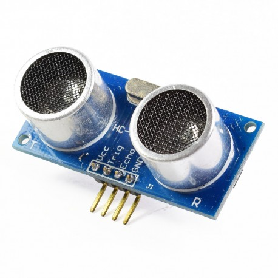
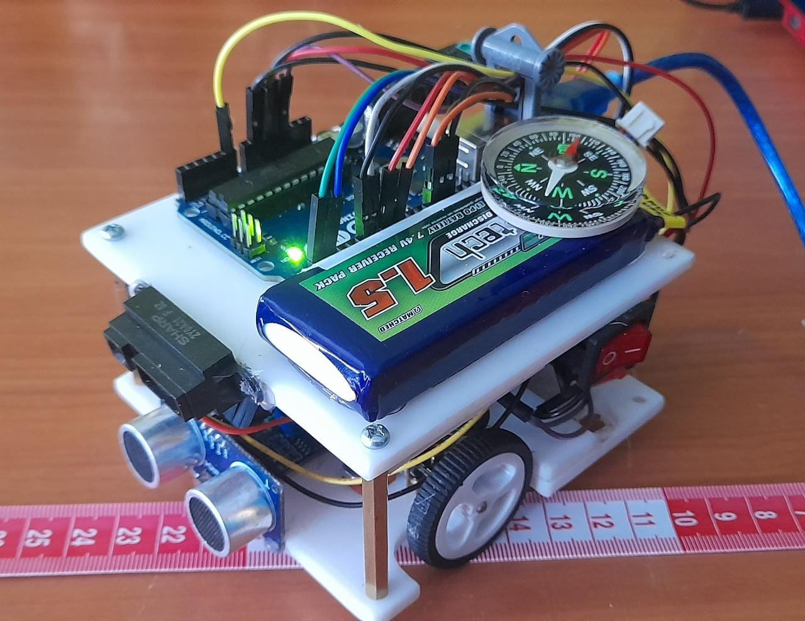
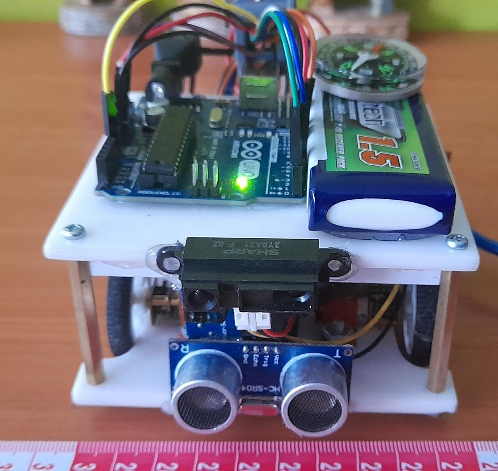
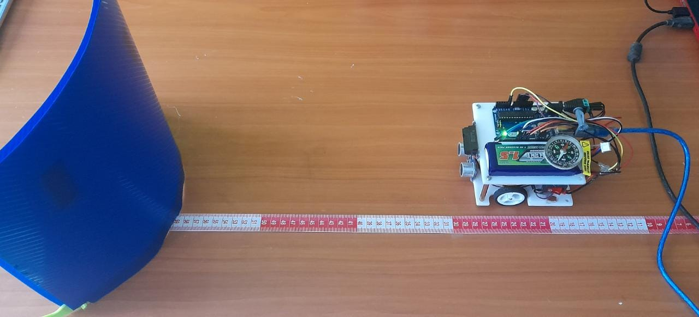
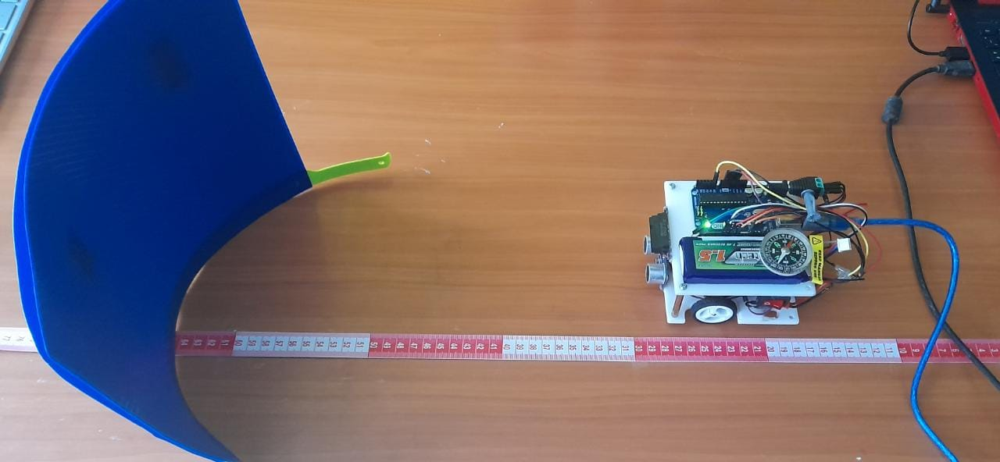

```{r setup, include=FALSE}
knitr::opts_chunk$set(echo = TRUE)
```

## Supervised Methods in Machine Learning
2nd report guideline: “kNN, Linear regression, and multilinear regression”

*El link al repositorio público de Github es el siguiente: https://github.com/AndresFHernandezJ/AssignmentTwo*

## 1. Predicción de una variable numérica

### 1.1 Adquisición de datos

Para la adquisición de datos se hizo uso de un robot móvil básico que contó con dos sensores de distancia, el sensor ultrasonico HC-SR04 y elsensor optico infrarrojo sharp gp2y0a21yk0f.

{width=30%}


{width=30%}

\vspace{1cm}

De esta manera se obtuvo un dataset de 50 observaciones de distancia en un rango de 20 cm a 68 cm en un intervalo de 6 cm.

A continuación se muestra el robot móvil con los sensores el cual mediante programación en el software de Arduino hizo la toma de los datos.

{width=40%}

{width=40%}


### 1.2 Modelo predictivo

#### a. 

No existió un pre procesamiento de los datos con respecto al dataset inicial debido a su estructura, el análisis de datos exploratorio se realizó de la siguiente manera.

El dataset resumidamente se ve de la siguiente manera.

\vspace{0.5cm}

```{r echo=FALSE, warning=FALSE}
library(psych)
Dataset1 <- read.csv("D:/Usr/Desktop/Andres/8vo Semestre/DataScience/AssignmentTwo/Datasets/ADQUISION_DATOS_SENSORES_20-68CM.csv")
head(Dataset1)
```

\vspace{0.5cm}

Del cual se puede identificar que cada una de las variables es de tipo int, y mas o menos se ve la estructura de sus datos, tambien es posible obtener datos estadísticos como los siguientes.

\vspace{0.5cm}

```{r echo=FALSE}
summary(Dataset1)
```

\vspace{0.5cm}

De esta manera se observa la estructura del dataset, los datos que se obtuvieron con el sensor ultrasónico y el infrarrojo y las distancias reales medidas, se observan los valores mínimos, máximos y sus respectivos valores del 25%, 50%, y 75% de los datos.

\vspace{0.5cm}

A continuación se muestra la gráfica relacionando cada una de las variables.

```{r echo=FALSE, out.width="85%", fig.align='center'}
Dataset1_df <- Dataset1
Dataset1_df$DISTANCIA <- as.factor(Dataset1_df$DISTANCIA)

pairs.panels(Dataset1_df[1:3]
             ,main = "Sensor Data (Ultrasónico = Blue, Infrarrojo = Red)"
             ,pch = 21
             ,cex = 2
             ,bg = c("blue", "red")[unclass(Dataset1_df$DISTANCIA)])

```

El gráfico anterior es una matriz de dispersión que muestra en su diagonal un histograma de cada variable individual y los gráficos de dispersión entre pares variables así como la correlación que hay entre ellas.

A continuación se muestran los gráficos de dispersión entre pares de variables de una manera mas completa.

```{r echo=FALSE, out.width="85%", fig.align='center'}
plot(Dataset1_df$OPTICO.INFRARROJO, Dataset1_df$ULTRASONICO,
     main = "Gráfico de Dispersión: Sensor Ultrasónico vs Sensor Óptico Infrarrojo",
     xlab = "Sensor Óptico Infrarrojo", ylab = "Sensor Ultrasónico")
```

\vspace{0.5cm}

Se observa la relación de dispersión que hay entre ambos sensores, se muestra un tipo de relación linear con algunos datos fuera de la relación.

\vspace{0.5cm}

```{r echo=FALSE, out.width="85%", fig.align='center'}
plot(Dataset1_df$ULTRASONICO, Dataset1_df$DISTANCIA,
     main = "Gráfico de Dispersión: Sensor Ultrasónico vs Distancia",
     xlab = "Sensor Ultrasónico", ylab = "Distacia")
```

\vspace{0.5cm}

Entre el sensor Ultrasónico y la distancia es posible visualizar una correlación fuerte entre ellos, de esta manera se ve una relación lineal casi perfecta entre sus datos.

\vspace{0.5cm}

```{r echo=FALSE, out.width="85%", fig.align='center'}
plot(Dataset1_df$OPTICO.INFRARROJO, Dataset1_df$DISTANCIA,
     main = "Gráfico de Dispersión: Sensor Óptico Infrarrojo vs Distancia",
     xlab = "Sensor Óptico Infrarrojo", ylab = "Distacia")
```

\vspace{0.5cm}

Por otro lado, la relación que hay entre el sensor Óptico infrarrojo y la distancia en menos fuerte, se puede denotar una relación lineal pero con una variabilidad alta en comparación al sensor anterior.

\vspace{0.5cm}

A continuación, para calcular la correlación en R es posible mediante el siguiente código.

```{r}
UltrasonicCorr <- cor.test(Dataset1$ULTRASONICO, Dataset1$DISTANCIA, method = "pearson")


InfraredCorr <- cor.test(Dataset1$OPTICO.INFRARROJO, Dataset1$DISTANCIA, method = "pearson")
```

Mediante el cual se hace un calculo de correlación entre las variables agregadas mediante el método especificado, en este caso Pearson. De esta manera se genera la siguiente información.

\vspace{0.5cm}

```{r echo=FALSE}
UltrasonicCorr <- cor.test(Dataset1$ULTRASONICO, Dataset1$DISTANCIA, method = "pearson")

# Pearson correlation test for infrared sensor
InfraredCorr <- cor.test(Dataset1$OPTICO.INFRARROJO, Dataset1$DISTANCIA, method = "pearson")


print(UltrasonicCorr)
print(InfraredCorr)

```

\vspace{0.5cm}

Se observa la correlación entre las variables las cuales son de 0.9957 para la relación entre Ultrasónico y Distancia y de 0.7575 para la relación entre Infrarrojo y Distancia.

Gracias a este análisis es posible dar una idea inicial para el posterior tratamiento.

\vspace{0.5cm}

#### b.

Para crear el modelo lineal para cada sensor se realizó la codificación en Rstudio de la siguiente manera.

\vspace{0.5cm}

```{r warning=FALSE}
UltrasonicM <- lm(DISTANCIA ~ ULTRASONICO, data = Dataset1)

InfraredM <- lm(DISTANCIA ~ OPTICO.INFRARROJO, data = Dataset1)
```

\vspace{0.5cm}

Donde la función lm permite obtener un modelo lineal de la variable inicial (Distancia) en función de la segunda, ya sea alguno de los dos sensores y gracias a la generación de un resumen se estableció lo siguiente:

\vspace{0.5cm}


 ***Ultrasónico:*** 

Se obtuvo un (Intercept) con un P value de <2e-16 *** al igual que ULTRASONICO lo que significa que son datos significativos y la probabilidad de que esa variable sea util para el modelo es muy alta.

Obteniendo como su ecuación característica lo siguiente.

***y=-8.84+0.017X***

\vspace{0.5cm}

***Infrarrojo:*** 

Se obutvo un (Intercept) con un P value de 7.26e-08 *** y para OPTICO.INFRARROJO un valor de 3.35e-11 *** al igual que con los datos del sensor ultrasónico son datos significativos y utiles solo que los de infrarrojo tienen un poco menos de probabilidad.

Obteniendo como su ecuación característica lo siguiente.

***y=-132.73+0.79X***

\vspace{0.5cm}

A continuación se generaron dos gráficas de cada sensor con respecto a la distancia real y la linea de tendencia que representa la dispersión.

\vspace{0.5cm}

```{r echo=FALSE, warning=FALSE, out.width="85%", fig.align='center'}
plot(Dataset1$ULTRASONICO, Dataset1$DISTANCIA,main = "Gráfico de Dispersión: Sensor Ultrasónico vs Distancia",
     xlab = "Sensor Ultrasónico", ylab = "Distancia")
abline(UltrasonicM)

plot(Dataset1$OPTICO.INFRARROJO, Dataset1$DISTANCIA,main = "Gráfico de Dispersión: Sensor Infrarrojo vs Distancia",
     xlab = "Sensor Infrarrojo", ylab = "Distancia")
abline(InfraredM)
```

\vspace{0.5cm}

#### c.

Para esta etapa se entreno un modelo de regresion multilinear a usando los datos de ambos sensores para predecir la distancia al muro.

La codificación para este caso fue la siguiente.

```{r echo=FALSE, warning=FALSE, message=FALSE}
library(dplyr)
Dataset1_df2 <- Dataset1 %>%
  select(ULTRASONICO, OPTICO.INFRARROJO, DISTANCIA)
```


```{r warning=FALSE}
MultilinearModel <- lm(DISTANCIA ~ ULTRASONICO + OPTICO.INFRARROJO, data = Dataset1_df2)
```

Donde en este caso también se usa la función lm que permite generar un modelo lineal para la Distancia, en este caso en función de ambos sensores al mismo tiempo.

A partir de la generación del resumen del modelo se establecieron los coeficientes del mismo de la siguiente manera.

```{r echo=FALSE, warning=FALSE}
MultilinearModel$coefficients #-9.13+0.017X+0.0015X
```

De esta manera se puede obtener una ecuacion caracteristica estructurada asi.

***y=-9.13+0.017X+0.0015X***

#### d.

Para probar el desempeño de los modelos mediante el uso de cross-validation en Rstudio, se baso en la siguiente codificacion.

```{r eval=FALSE}
predictors <- colnames(Dataset1)[-3]

sample.index <- sample(1:nrow(Dataset1)
                       ,nrow(Dataset1)*0.7
                       ,replace = F)


train.data <- Dataset1[sample.index,,drop=F]
test.data <- Dataset1[-sample.index,,drop=F]
```

El código anterior genera una variable llamada predictivos, a la cual se le asignaran las variables predicadoras del datase, las cuales son el sensor Ultrasonido y el Óptico Infrarrojo, por ellos aparece un -3, lo que indica la exclusión de la tercera columna del dataset que corresponde a la Distancia, la cual es nuestra variable objetivo o variable a predecir.

Luego se crea una muestra del dataset con la función sample donde se especifica las proporciones a tomar, de esta manera esa muestra cuenta con el 70% de los datos totales tomados de manera aleatoria y los separa del otro 30%, de esta manera para la siguiente etapa se crean dos conjuntos, uno de entrenamiento que cuenta con las muestras anteriores tomadas, es decir el 70% de los datos totales del dataset, y un segundo conjunto que cuenta con el porcentaje restante de los datos, es decir el 30%.

A continuación se llaman los modelos anteriormente creados, tanto los dos lineales de cada sensor como el multilinear.

```{r eval=FALSE}
UltrasonicM <- lm(DISTANCIA ~ ULTRASONICO, data = train.data)
InfraredM <- lm(DISTANCIA ~ OPTICO.INFRARROJO, data = train.data)
MultilinearModel <- lm(DISTANCIA ~ ., data = train.data)
```

Con la etapa anterior se le asigna el conjunto de datos de entrenamiento a cada uno de los 3 modelos lo que significa que tendrán un 70% de los datos del dataset original de manera aleatoria.

```{r eval=FALSE}
predictionsU <- predict(UltrasonicM, test.data)
predictionsI <- predict(InfraredM, test.data)
predictionsM <- predict(MultilinearModel, test.data)
```

Esto ultimo muestra la asignación del 30% de los datos restantes, es decir los datos de prueba a una variable de predicción para cada sensor y su modelo correspondiente.

Luego, para observar el error en las predicciones se realiza lo siguiente:

```{r eval=FALSE}
RMSEU.df <- data.frame(predicted = predictionsU,
                       actual = test.data$DISTANCIA
                       , SE = (predictionsU -test.data$DISTANCIA))
RMSEI.df <- data.frame(predicted = predictionsI,
                       actual = test.data$DISTANCIA
                       , SE = (predictionsI -test.data$DISTANCIA))

RMSEM.df <- data.frame(predicted = predictionsM,
                       actual = test.data$DISTANCIA
                       , SE = (predictionsM -test.data$DISTANCIA))
```

El código anterior lo que hace es generar un nuevo data frame para cada uno de los 3 modelos en el cual mediante las predicciones y los datos de prueba se calcula el error, por lo cual se obtiene que:

***Modelo Ultrasónico:*** Cuenta con un error de -0.323501 

Se muestra un resumen de la tabla con las predicciones, los datos reales y el error

```{r echo=FALSE, warning=FALSE}
RMSEU.df <- readRDS("RMSEU.df.rds")
head(RMSEU.df)
```

***Modelo Óptico Infrarrojo:*** Cuenta con un error de -4.465875

Se muestra un resumen de la tabla con las predicciones, los datos reales y el error

```{r echo=FALSE, warning=FALSE}
RMSEI.df <- readRDS("RMSEI.df.rds")
head(RMSEI.df)
```

***Modelo Multilinear:*** Cuenta con un error de -0.2946621

Se muestra un resumen de la tabla con las predicciones, los datos reales y el error

```{r echo=FALSE, warning=FALSE}
RMSEM.df <- readRDS("RMSEM.df.rds")
head(RMSEM.df)
```

***Discusión de los resultados***

Se puede observar que según los RMSE obtenidos para cada uno de los 3 modelos, son relativamente bajos e indican un buen desempeño, se puede destacar negativamente el error del sensor Óptico Infrarrojo, debido a que tanto en el error obtenido como por ejemplo en el dato numero 17 de la tabla anteriormente mostrada en ocasiones presenta predicciones con errores muy altos como lo es en ese dato donde predijo una distancia de 49.9 cm y la real siendo de 62 cm, el error fue de -12.09 cm y debido a que las tablas anteriores son un resumen, no se puede observar que en la tabla original presenta varias veces errores similares.

Por otro lado, tanto para el modelo del sensor ultrasónico como para el modelo multilinear (El cual depende de ambos sensores), presentan predicciones similares y buenas en comparación al anterior mencionado, sus errores son bajos y no presentan predicciones con errores altos en ninguna fila de la tabla completa.

De esta manera, es posible observar que como se vio inicialmente con los gráficos de dispersión, el sensor Ultrasónico el cual ya presentaba una dispersión lineal, tuvo un buen desempeño en su modelo individual, por otra parte con el sensor Óptico Infrarrojo, debido a su gráfico de dispersión detallado al inicio de esta primera parte de la actividad, se observa que su desempeño no fue tan lineal como con el otro sensor, lo cual se podía ver previamente en dicho gráfico.

Pero para el modelo multilinear, se ve la compensación entre ambos sensores y muestran un desempeño muy bueno en el desarrollo de las predicciones.

### 1.3 Validacion del modelo

Para esta ultima sección se van a usar los mejores modelos conseguidos en los entrenamientos que fueron guardados, cargados y utilizados de la siguiente manera. (el siguiente ejmplo muestra con 1 de los 3 modelos el proceso, pero dicho proceso se repite con cada uno de los 3 modelos)

```{r eval=FALSE}
#Se guardan el modelo
saveRDS(RMSEU.df, "RMSEU.df.rds")

#Se cargan el modelo
UltrasonicM <- readRDS("UltrasonicM.rds")

#Se carga el nuevo dataset
nuevos_datos1 <- read.csv("D:/Usr/Desktop/Andres/8vo Semestre/DataScience/AssignmentTwo/Datasets/XXXX.csv")

# Se hace la prediccion
prediccionesU <- predict(UltrasonicM, nuevos_datos1)

# Para el desempeño se calcula el error
actual <- nuevos_datos1$DISTANCIA
rmseU <- sqrt(mean((prediccionesU - actual)^2))

# Se muestra el error Calculado
rmseU

# Se genera una tabla que indica las predicciones, los datos reales y el error
rmseU.df <- data.frame(predicciones = prediccionesU
                  ,actual = nuevos_datos1$DISTANCIA
                  ,SE = (prediccionesU - nuevos_datos1$DISTANCIA))

view(rmseU.df)

```

La manera anterior es de las formas mas especificas que se diseñaron para evaluar el desempeño de los modelos con nuevos datasets.


## 2. Predicción de variables categoricas

### 2.1 Adquisición de datos


Para la adquisición de datos se hizo uso nuevamente del robot móvil mencionado inicialmente, en este caso nuestras nuevas variables categóricas a predecir son 3 tipos de obstáculo a sensar, siendo obstáculos plano, convexo y cóncavo.

A continuación se presentan los dos obstáculos diferentes al plano.

{width=40%}

{width=40%}


### 2.2 Modelo predictivo

#### a. 

El dataset resumidamente se ve de la siguiente manera.

\vspace{0.5cm}

```{r echo=FALSE, warning=FALSE}
library(psych)
Dataset2 <- read.csv("D:/Usr/Desktop/Andres/8vo Semestre/DataScience/AssignmentTwo/Datasets/ADQUISION_DATOS_PLANA_CONCAVA_CONVEXA_2.csv")
head(Dataset2)
```

\vspace{0.5cm}

El tratamiento de los datos radica en comprobar el comportamiento y la relación entre estos y si son aptos para hacer una predicción o modelo matemático para el propio análisis de datos en este caso, en un contexto predictivo siendo que se pueden utilizar varios métodos matemáticos para lograr más o menos  precisión en dichos datos probables, para este caso se utilizan las librerías library(psych) y la librería (ggplot2), la primera de estas es usada normalmente para análisis multivariante mediante análisis factorial, análisis de componentes principales, análisis de conglomerados y análisis de confiabilidad; la librería  (ggplot2) permite personalizar los gráficos con temas. se puede personalizar cada detalle de un gráfico, como los colores, tipos de líneas, fuentes o alineación, entre otros, usando los componentes de la función (theme). En la sección anterior de código se comienza citando dichas librerías junto con la función read.csv que en este caso permite tomar directamente el dataset a analizar del almacenamiento interno sin necesidad de usar un parent folder; así mismo este dataset se iguala a la variable dataset 2 que junto con la sentencia head() permiten hacer una observación de confirmación de que el dataset si fue guardado.

\vspace{0.5cm}

```{r echo=FALSE}
summary(Dataset2)
```

\vspace{0.5cm}

De esta manera se observa la estructura del dataset, los datos que se obtuvieron con el sensor ultrasónico y el infrarrojo y las distancias reales medidas, se observan los valores mínimos, máximos y sus respectivos valores del 25%, 50%, y 75% de los datos al igual que la variable PARED la clase como character.

\vspace{0.5cm}

A continuación se muestra la gráfica relacionando cada una de las variables.

```{r echo=FALSE, out.width="85%", fig.align='center', warning=FALSE, message=FALSE}
library(psych)
library(ggplot2)
Dataset2_df <- Dataset2
Dataset2_df$DISTANCIA <- as.factor(Dataset2_df$DISTANCIA)

pairs.panels(Dataset2_df,
             main = "Sensor Data (Ultrasónico = Blue, Infrarrojo = Red)",
             pch = 21,
             cex = 2,
             bg = c("blue", "red")[unclass(Dataset2_df$DISTANCIA)],
             bg2 = c("gray80", "pink", "skyblue")[unclass(Dataset2_df$PARED)])

```

\vspace{0.5cm}

El gráfico anterior nuevamente es una matriz de dispersión que muestra en su diagonal un histograma de cada variable individual y los gráficos de dispersión entre pares variables así como la correlación que hay entre ellas.

Esta sección es de vital importancia puesto que evidencia gráficamente el comportamiento de los datos respecto a la variable distancia y la variable pared, esto teniendo en cuenta que como factor se usa más la variable distancia puesto que sería en cierto modo una variable predictora, asi mismo usando los parámetros de la sentencia pairs.panels se ajustan los colores tanto de  los indicadores de la variable distancia como los tipos de pared; usando colores como celeste rosado, gris etc.

A continuación se muestran un grafico de dispersion entre el sensor Ultrasónico y el Óptico Infrarrojo con base a los 3 tipos de pared.

\vspace{0.5cm}

```{r echo=FALSE, out.width="85%", fig.align='center', warning=FALSE, message=FALSE}
library(psych)
library(ggplot2)
ggplot(Dataset2, aes(x = ULTRASONICO, y = OPTICO.INFRARROJO, color = PARED)) +
  geom_point() +
  labs(title = "Gráfico de dispersión: Sensores y tipos de pared",
       x = "Sensor Ultrasónico", y = "Sensor Óptico Infrarrojo",
       color = "Tipo de pared")


```

Por último en la sección de la sentencia ggplot en adelante, se describe y se ingresan las características de la gráfica correspondiente a la dispersión, esto teniendo en cuenta las variables de sensor infrarrojo (eje y), sensor de ultrasonido (eje x) y los tipos de pared con los colores rosa, verde y celeste; de este grafico se puede observar que la dispersión entre datos no es muy pronunciada y tiende a un comportamiento lineal en gran parte de su trayecto.

Lo que supone una representación óptima para tratar con un modelo predictivo dicho conjunto.

#### b. 

Para el entrenamiento de un modelo de clasificación kNN para predecir la forma de la pared, se realizaron en total 3 opciones de kNN, siendo las dos primeras las que contienen el funcionamiento interno del kNN variando el método de normalización entre min-max y z-score, por ultimo el tercer metodo el que se uso definitivamente para la predicción de nuevos datos fue el creado mediante la librería de caret la cual permite simplificar el proceso en este tipo de modelo.

```{r cars, eval=FALSE}
normalise <- function(x){
  return((x-min(x))/(max(x)-min(x)))
  }
```

se obtiene una variable que contiene una función con parámetro de entrada x el cual funcionara posteriormente para aplicar este método de valores mínimos y máximos a una variable especifica que puede ser encontrada en el dataset.

Posterior a esto se necesita adquirir el dataset y configurar el propio guardado del script ya sea con una carpeta padre o el archivo del script y el dataset en la misma carpeta, en este caso se hace uso de una carpeta padre que contiene otras dos con los nombres "datasets" y "script" respectivamente, por lo tanto se usa las siguientes sentencias de código para crear una variable de nombre "parent folder" que permitirá acceder al dataset en pasos posteriores.

***variables y direccion para folder padre***

```{r echo=TRUE, eval=FALSE}
library(tidyverse)
# to get current script folder
folder <- dirname(rstudioapi::getSourceEditorContext()$path)
parentFolder <- dirname(folder)
```

De esta manera se tiene que es necesario citar la librería "tidyverse" para hacer uso de sus funciones al tratar los datos del dataset, las dos ultimas lineas permiten crear variables auxiliares para en las siguientes líneas acceder al dataset y dirigirse al propio script mediante la dirección en el almacenamiento del dispositivo.

***Acceso al archivo por direccion de almacenamiento***

```{r echo=TRUE, eval=FALSE}
# Accessing by file address
library(tidyverse)
Pared_PCC <- read.csv("D:/Usr/Desktop/Andres/8vo Semestre/DataScience/AssignmentTwo/Datasets/ADQUISION_DATOS_PLANA_CONCAVA_CONVEXA_2.csv")
```

El dataset a conseguir tiene por nombre "PARED_PCC" siendo que también es una variable a la cual se le ingresa la dirección en almacenamiento interno donde se guardó inicialmente dicho dataset, siendo en esto la línea con la instruccion "read.csv" la encargada de llevar la información a la variable haciendo que solo sea necesario colocar la última sección de esta sin tener que poner la ruta inicial al disco la cual siempre seria la misma en todos los archivos.

***"ONE-HOT ENCODING"- por comparacion logica***

```{r echo=TRUE, eval=FALSE}
# Accessing by file address
################ One-hot encoding ########
# by logical comparison
colnames(Pared_PCC)[4] <- c("PARED")
Pared_PCC$CONVEXA <-
  as.numeric(Pared_PCC$PARED=="CONVEXA")

Pared_PCC$PLANA <-
  as.numeric(Pared_PCC$PARED=="PLANA")

Pared_PCC$CONCAVA <-
  as.numeric(Pared_PCC$PARED=="CONCAVA")


```

En esta sección de selección de variables en la línea con la sentencia "colnames" se decide ajustar el nombre de la variable pared debido a un error en los caracteres, después se decide usar las sentencias de las líneas que contienen "Pared\$" para crear nuevas variables de tipo "dummy" teniendo en cuenta la variable pared la cual contiene los tres tipos de pared y cuantas veces aparecieron estos datos en las mediciones; las variables creadas tienen los nombres de "CONVEX" para la pared de tipo convexa, "AXIS" para la pared de tipo plana y "CONCAVE" para la pared de tipo cóncava; en las columnas de dichas variables se visualizaran solo datos binarios de "0" y "1" siendo "0" el indicador de que el dato no aparece o no fue registrado en la columna "PARED" del dataset original "1" indicara que si se registró o si apareció el dato o ese tipo de obstáculo especifico en la variable "PARED"; por ultimo

***Cambiar variables de clase a factores***

```{r echo=TRUE, eval=FALSE}
# Changing the class variable to factor
Pared_PCC$CONVEX <- as.factor(Pared_PCC$CONVEX)
levels(Pared_PCC$CONVEX)

Pared_PCC$AXIS<- as.factor(Pared_PCC$AXIS)
levels(Pared_PCC$AXIS)

Pared_PCC$CONCAVE <- as.factor(Pared_PCC$CONCAVE)
levels(Pared_PCC$CONCAVE)
```

Después de ejecutar las sentencias que definen las variables de tipo "dummy" se tienen columnas con datos en tipo binario pero como lo mostraría el ambiente global o environment de variables, estos datos binarios se clasifican como tipo numérico también, por lo tanto se hace necesario usar las sentencias que contienen la instrucción "as.factor()" para lograr que dichos términos sean factores y así poder hacer el proceso matemática que conlleva la normalización ya sea por z-normalización o método de mínimos y máximos.

***EDA***

```{r echo=TRUE, eval=FALSE}
#EDA (only 2 numeric features in this data)

#[1]ULTRASONIDO-[2]OPTICO/INFRARROJO
plot(Pared_PCC[1:2])
plot(Pared_PCC[1:2], pch=21
     , bg= c("red", "blue")[unclass(Pared_PCC$CONCAVE)])
plot(Pared_PCC[1:2], pch=21
     , bg= c("red", "yellow")[unclass(Pared_PCC$AXIS)])
plot(Pared_PCC[1:2], pch=21
     , bg= c("red", "green")[unclass(Pared_PCC$CONVEX)])

```

En este paso se rechaza el usar la variable de distancia puesto que son de mayor relevancia las variables de "ULTRASONIDO" y "OPTICO-INFRARROJO" esto debido también a que el método requiere y solicita de solo dos variables predictoras como lo son las anteriormente mencionadas, en este paso lo más resaltable es que se necesita predecir un total de 3 variables como si estuvieran en una sola más grande por lo tanto se usan diferentes graficas para observar el comportamiento de los datos teniendo como resultado que para los tres tipos de obstáculo el comportamiento es el mismo, suponiendo que es correcto usar esta distribución considerándola adecuada debido a que el algoritmo logra distinguir los diferentes grupos. En este tipo de sentencias se ajusta las columnas que se desean incluir y tambien la forma de los indicadores que en este caso al ser la sentencia de pch=21 se deduce que tienen forma de circulo.

***Comprobar las proporciones y el nivel de los datos***

```{r echo=TRUE, eval=FALSE}
# check proportions of the class levels
prop.table(table(Pared_PCC$CONVEX))
prop.table(table(Pared_PCC$AXIS))
prop.table(table(Pared_PCC$CONCAVE))

hist(Pared_PCC$ULTRASONICO, breaks = 50)
hist(Pared_PCC$OPTICO.INFRARROJO, breaks = 50)
```

En lo que respecta a proporciones la instrucción prop.table muestra la separación o relación entre los datos en aparente forma de porcentaje siendo para "CONVEX" una proporción 0.6875-0.3125, para "AXIS" una proporción 0.625-0.375 y por ultimo para "CONCAVE" una proporción 0.6875-0.3125; esto en términos generales es una buena proporción teniendo en cuenta que ara la normalización se usaran proporciones 70-30, este nivel de dispersión o relación entre los datos puede estar en el rango utilizable para el proceso de predicción.

Así mismo en las sentencias con la instrucción "hist" se puede observar cómo se comportan los datos o su distribución en el diagrama de barras siendo lo más relevante que el sensor infrarrojo tiene sus datos distribuidos de tal forma que parece seguir la forma de la campana de gauss y el sensor ultrasonido tiene su pico de datos orientado mas a la derecha esto indicaria que el sensor infrarrojo puede tener cierta caracteriztica que le ermita ser un poco mas preciso o adecuado con los datos que en este caso predeciran la forma del obstaculo.

***Normalización***

```{r echo=TRUE, eval=FALSE, eval=FALSE}

##### Normalisation #####
normData <- Pared_PCC
standardData <- Pared_PCC
```

Como primer paso en la normalización se necesita crear dos dataset o variables para guardar el dataset esto con el fin de poder usar estas dos secciones de código para usar los dos métodos, ya sea "z-normalization" o con valores mínimos y máximos; teniendo esto en cuenta "normdata" almacena el dataset para usarlo con el método de mínimos y máximos y "standarData" usa el dataset para efectuar la "z-normalization".

***METODO DE MINIMO Y MAXIMO***

```{r echo=TRUE, eval=FALSE}

### min-max 

normData$`OPTICO-INFRARROJO`<-normalise(Pared_PCC$OPTICO.INFRARROJO)
normData$ULTRASONICO<-normalise(Pared_PCC$ULTRASONICO)

```

En este método se necesita hacer una operación con los valores mínimos y máximos de las columnas cuyos valores sean predictores siendo aquí las columnas de "ULTRSONIDO" y "OPTICO-INFRARROJO" las mejores propuestas para dar seguimiento al proceso. Así entonces siendo que el dataset o variable normdata se pensó para dar paso a este proceso se usa este junto con la sentencia "normalise" que como se vio más arriba tiene su ecuacion planteada al inicio del código en este caso. dando lugar a una cadena de números que van de cero a 1.

***METODO DE "Z-NORMALIZATION"***

```{r echo=TRUE, eval=FALSE}

### z-score standardisation

standardData$OPTICO.INFRARROJO<-scale(standardData$OPTICO.INFRARROJO)
standardData$ULTRASONICO<- scale(standardData$ULTRASONICO)


```

Para el proceso de normalización por z se úsala sección que involucra a standarData siendo que aquí cambia la operación y el valor resulta menos pequeño en escala.

***MUESTREO***

```{r echo=TRUE,warning=FALSE, eval=FALSE}

#index for random sampling

sample.index <- sample(1:nrow(Pared_PCC) ,nrow(Pared_PCC)*0.7,replace = F)
```

Para la función sample.index se mantiene una proporción de 70% a 30% siendo un 70% para el entrenamiento y un 30% en los datos dando así una muestra con cerca de 40 datos aproximadamente.

***ENTRENAMIENTO Y "ORIGINAL DATA"***

```{r echo=TRUE, eval=FALSE}
#training
k <- 3
predictors <- c("ULTRASONICO","OPTICO.INFRARROJO")

# original data
train.data <-
  Pared_PCC[sample.index,c(predictors,"CONCAVA","PLANA","CONVEXA"),drop=F]
test.data <- Pared_PCC[-sample.index,c(predictors,"CONVEXA","PLANA","CONCAVA"),drop=F]

```

Siendo el numero de la variable k igual a 3 se necesita ajustar el nombre de variables predictoras siendo en este caso "ultrasonido" y "óptico-infrarrojo", siendo que estas ya están normalizadas ya sea que se haya escogido el método por normalización por z o por valores mínimos y máximos.

```{r echo=TRUE,eval=FALSE}
library(class)
predictionconvex <- knn(train = train.data[predictors]
                  , test = test.data[predictors]
                  ,cl = train.data$CONVEX, k=k)

predictionaxil <- knn(train  = train.data[predictors]
                         , test = test.data[predictors]
                         ,cl = train.data$AXIS, k=k)


predictionconcave<- knn(train = train.data[predictors]
                        , test = test.data[predictors]
                        ,cl = train.data$CONCAVE, k=k)

```

posterior a haber adquirido la relacion entre predictores y variables objetivo en la variable test.data se crean tres bloques para cada tipo de pared siendo que en este paso se hace la prediccion generalmente, anexando que se usa la propia funcion knn y lo que se debe tomar en cuenta son aquellos parametros como la normalizacion y las variables objetivo y predictoras.

***kNN Caret definitivo***

Finalmente se hizo uso de la librería caret para simplificar todo el proceso anterior y así obtener el modelo definitivo.

```{r echo=FALSE, message=FALSE, warning=FALSE}
library(tidyverse)
library(caret)
library(gmodels)
```


```{r eval=FALSE}

Dataset2$PARED <- as.factor(Dataset2$PARED)
#index for random sampling
sample.indexW <- sample(1:nrow(Dataset2)
                       ,nrow(Dataset2)*0.7
                       ,replace = F)

predictorsW <- c("ULTRASONICO", "OPTICO.INFRARROJO", "DISTANCIA")

train.dataW <- Dataset2[sample.indexW
                        ,c(predictorsW,"PARED")
                        ,drop=F]

test.dataW <- Dataset2[-sample.indexW
                        ,c(predictorsW,"PARED")
                        ,drop=F]
```

Igualmente se hace el cambio de la variable PARED a factor, luego se crea una muestra del dataset que contenga datos aleatorios del 70% de los datos totales, para luego crear una variable de predictores, la cual contiene a aquellas 3 variables que nos permitirán predecir el tipo de pared, para finalmente crear tanto un conjunto de datos de entrenamiento con el 70% de la muestra generada y un conjunto de datos de prueba con el 30% restante no tomado por la muestra.

```{r eval=FALSE}
ctrl <- trainControl(method="cv", p=0.7)
knnFit <- train(PARED ~ ULTRASONICO+OPTICO.INFRARROJO+DISTANCIA
                , data = train.dataW
                , method = "knn"
                , trControl = ctrl
                , preProcess = c("range")
                , tuneLength = 20)
```

Posteriormente mediante el codigo mostrado que ya hace parte de las funciones que permite la librería caret, se crea una variable ctrl que va a tener la función de trainControl, la cual define el método y el porcentaje, en este caso cross validation de 70% - 30%, luego se crea la variable modelo a la cual se le asigna la función de la librería caret, train, donde se especifica, la variable objetivo en función de las variables predictoras, los datos para el entrenamiento, el metodo del modelo, en este caso kNN, el trainControl establecido inicialmente y mediante el prePorcess range se establece el método de normalización min-max.

Finalmente se obtiene el siguiente modelo kNN.

```{r echo=FALSE}
knnFit <- readRDS("knn_model.rds")
knnFit

```

Esta información presenta datos iniciales como los 100 datos de muestra, los 3 predictores y las 3 clases a predecir siendo estas 'CONCAVA', 'CONVEXA'y 'PLANA'.

Igualmente se presenta la precisión con diferentes valores de k, es por esto que el método kNN mediante la librería caret es mucho mas simple ya que hace pruebas y selecciona el valor de k mas optimo y mas preciso para el modelo,en el final de la información muestra que el valor final de k fue de 5.

```{r echo=FALSE}
library(tidyverse)
library(caret)
library(gmodels)
knnFit <- readRDS("knn_model.rds")
test.dataW <- readRDS("test_data")
knnPredict <- readRDS("knn_predict")

CrossTable(test.dataW$PARED, knnPredict, prop.chisq = FALSE)
```


#### c.

Finalmente se genera una tabla CrossTable la cual permite observar al lado derecho los datos totales para cada una de las 3 variables objetivo y en la matriz se puede observar las predicciones correctas y erróneas.

Se observa que para la predicción de cóncava, de 13 variables totales 8 si fueron cóncavas y las restantes fueron entre convexa y plana, igualmente para las predicciones siguientes, convexa tuvo 9 correctas de 16 totales y por ultimo plana tuvo 10 correctas de 15 totales.

De esta manera se puede visualizar el desempeño del modelo knn que es bueno en gran medida y en este tipo de predicción pueden existir diferentes aspectos que pueden hacer variar el rendimiento como lo es la distancia a la que se trata de predecir la forma de la pared, asi mismo como la pared, siendo entre la cóncava y convexa formas complejas de sensar en comparación a la pared plana.

```{r eval=FALSE}
#Librerías necesarias con las que se entreno el modelo
library(tidyverse)
library(caret)
library(gmodels)

#Carga del modelo entrenado previamente guardado
knnFit <- readRDS("knn_model.rds")

#Carga de los nuevos datos a tratar
nuevos_datos <- read.csv("D:/Usr/Desktop/Andres/8vo Semestre/DataScience/AssignmentTwo/Datasets/XXXX.csv")

#Predicción con base a los nuevos datos y el modelo entrenado
prediccionesX <- predict(knnFit, newdata = nuevos_datos)

#Verificación del desempeño con los nuevos datos 
CrossTable(nuevos_datos$PARED, prediccionesX, prop.chisq = FALSE)

```

Finalmente el codigo anterior es un nuevo script en R creado donde inicialmente se cargan las librerias con las que trabaja el modelo entrenado, luego se carga el modelo guardado en el entrenamiento para luego cargar el dataset X a tratar, realizar las predicciones y finalmente obtener una matriz de CrossTable para verificar el desempeño.
